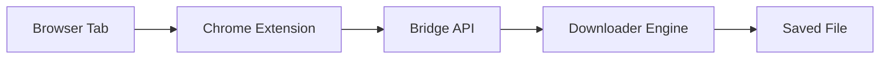

# IDM - Internet Download Manager


> A fast, open source download manager with Chrome extension integration,
> multi-chunk parallel downloading, and smart file detection.

## ✨ Features

- ⚡ Multi-chunk parallel downloader with resumable transfers
- 🔎 Smart file detection and scoring for links, media, and redirects
- 🌐 Async bridge API for browser-to-desktop communication
- 🧩 Chrome extension with page capture, popup controls, and queue actions
- 🔐 Secure token pairing and encrypted credential handling
- 🗂️ Download categorization and configurable save locations
- 📊 Transfer telemetry, speed tracking, and health monitoring
- 🧵 Concurrent download queue management with cancellation support
- 🖥️ Qt desktop UI with tray integration and minimized background mode

## 📸 Screenshots

- Desktop app screenshot: `docs/screenshots/desktop-app.png`
- Extension popup screenshot: `docs/screenshots/extension-popup.png`
- Download dialog screenshot: `docs/screenshots/download-dialog.png`

## 🚀 Quick Start

### Requirements

- Python 3.10+
- Windows, Linux, or macOS
- Google Chrome (for extension integration)

### Installation

1. Clone the repository:

```bash
git clone https://github.com/your-org/idm.git
cd idm
```

2. Create and activate a virtual environment:

```powershell
py -m venv .venv
& ".\.venv\Scripts\Activate.ps1"
```

```bash
python3 -m venv .venv
source .venv/bin/activate
```

3. Install dependencies:

```bash
python -m pip install --upgrade pip
python -m pip install -r requirements.txt
```

4. Start the desktop app:

```bash
python main.py
```

### Install the Chrome Extension

1. Open `chrome://extensions`
2. Enable Developer mode
3. Click Load unpacked
4. Select the `extension/` folder

### Pair Extension with Desktop App

1. Start the desktop app first
2. Open the extension popup
3. Click Pair / Connect
4. Confirm connection status shows healthy in the app

## 📖 How It Works



The extension captures candidate download links and sends structured metadata
to the local bridge API. The desktop app validates, scores, and schedules
downloads using async workers and chunked network IO.

## ⚙️ Configuration

- Config file location: `config.json` (project root for local dev)
- Key settings:
  - Save path and category routing
  - Maximum concurrent downloads
  - Per-download chunk count
  - Bridge API host/port and pairing token behavior
  - Retry policy, timeout, and network limits

## 🔧 Building from Source

### Windows

```powershell
powershell -ExecutionPolicy Bypass -File scripts/build_windows.ps1
```

### Linux

```bash
chmod +x scripts/build_linux.sh
./scripts/build_linux.sh
```

## 🤝 Contributing

See [CONTRIBUTING.md](CONTRIBUTING.md) for the full guide.

Quick guide:

1. Fork the repository
2. Create a feature branch
3. Add tests for changes
4. Open a pull request

## 📋 Changelog

See [CHANGELOG.md](CHANGELOG.md).

## 📄 License

This project is licensed under the MIT License. See [LICENSE](LICENSE).

## 🏷️ Release Strategy

Versioning follows Semantic Versioning:

| Version Type | When to Use | Example |
| --- | --- | --- |
| Patch `1.0.X` | Bug fixes only | `1.0.1` - fix double download |
| Minor `1.X.0` | New features, backwards compatible | `1.1.0` - add FTP support |
| Major `X.0.0` | Breaking changes, major rewrites | `2.0.0` - new UI overhaul |

How to release a new version:

1. Update `CHANGELOG.md` and move Unreleased items to a version section.
2. Bump versions in `pyproject.toml` and `extension/manifest.json`.
3. Commit: `chore: release v1.0.1`
4. Tag: `git tag v1.0.1`
5. Push: `git push && git push --tags`
6. GitHub Actions builds artifacts automatically.
# internet-download-manager
